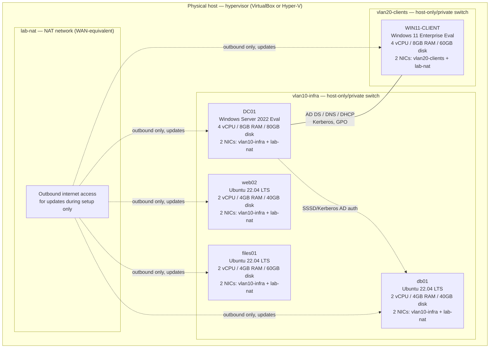

# Homelab build guide

> This is a step-by-step guide for actually standing up the practice lab
> described at a design level in
> [`network-lab/topology.md`](../network-lab/topology.md), using free/
> local tools on a single physical machine. It does not repeat that
> document's network design — read it first for the "why" (VLAN
> segmentation, IP ranges, what each host is for); this guide covers the
> "how" (which ISOs, which hypervisor settings, which exact install
> steps) to actually build it. Lab/practice environment only, against a
> fictitious `contoso.local` domain — not a real employer's
> infrastructure.

## What you end up with

By the end of this guide: a Windows Server domain controller
(`DC01`), a Windows 11 domain-joined client, and three Ubuntu Server
22.04 LTS hosts (`db01`, `web02`, `files01`), all networked per
`network-lab/topology.md`'s VLAN design, running as VMs on one physical
host — enough to reproduce every ticket and runbook in this repo against
a real (if small) environment rather than describing them abstractly.

## Prerequisites

### Hardware (single physical host running everything)

- **CPU**: 4+ physical cores with virtualization extensions enabled in
  BIOS/UEFI (Intel VT-x or AMD-V) — required, not optional; the
  hypervisor won't run 64-bit guests without it.
- **RAM**: 32GB recommended minimum for running all six VMs
  simultaneously with reasonable headroom (see per-VM allocations
  below); 16GB is workable if VMs are run a few at a time rather than
  all together.
- **Disk**: 250GB+ free on an SSD (a mechanical HDD will work but will
  make Windows Server installs and AD operations noticeably slower).

### Software

- **Hypervisor** — either works; this guide gives steps for both where
  they diverge:
  - **VirtualBox** (free, cross-platform) — used for the exact menu paths
    in this guide.
  - **Hyper-V** (free, built into Windows Pro/Enterprise) — noted as an
    alternative at each step; the *concepts* (virtual switches, VM
    specs) are identical, only the exact menu path differs.
- **Windows Server evaluation ISO** — Microsoft provides a free
  180-day evaluation of Windows Server (Standard or Datacenter,
  Desktop Experience) directly from the Microsoft Evaluation Center.
  180 days is more than enough for a practice lab; extend or rebuild
  the DC when it expires rather than trying to license it permanently —
  this is explicitly a lab tool, not a production deployment.
- **Windows 11 evaluation/ISO** — a licensed copy, or the free
  Enterprise evaluation from the Microsoft Evaluation Center, for the
  domain-joined client VM.
- **Ubuntu Server 22.04 LTS ISO** — free, from ubuntu.com — used for all
  three Linux VMs.

## Step 1 — Create the virtual networks first, before any VMs

Building the network layer before any VM exists avoids having to go back
and rewire adapters on running VMs later.

### VirtualBox

1. **File** → **Tools** → **Network Manager**.
2. **NAT Networks** tab → **Create** — this becomes the lab's path to the
   internet (equivalent to the topology doc's WAN uplink), shared by
   whichever VMs need outbound access (primarily for Windows/Ubuntu
   updates during setup). Name it `lab-nat`.
3. **Host-only Networks** tab → **Create** twice, for the two internal
   VLANs — name them `vlan10-infra` (maps to VLAN 10 —
   10.10.10.0/24 in the topology doc) and `vlan20-clients` (maps to
   VLAN 20 — 10.10.20.0/24). Disable each host-only network's own DHCP
   server (**Properties** → **DHCP Server** tab → uncheck **Enable
   Server**) — DHCP for these networks is provided by DC01 itself once
   built, matching the topology doc's design, not by VirtualBox.

### Hyper-V (alternative)

1. **Hyper-V Manager** → **Virtual Switch Manager**.
2. Create an **External** virtual switch for the NAT/WAN-equivalent path
   (or **Internal** + Windows ICS/NAT if you want the host fully
   isolated from your real network — either works for a lab).
3. Create two **Private** virtual switches, one per VLAN
   (`vlan10-infra`, `vlan20-clients`) — a Private switch in Hyper-V is
   VM-to-VM only, equivalent to a VirtualBox host-only network with DHCP
   disabled.

## Step 2 — VM/VLAN layout

This diagram shows the **build-level** view — VM resource allocations
and which virtual network adapter each VM plugs into — as opposed to
`network-lab/topology.md`'s diagram, which shows the **logical** network
design (IP addressing, traffic flows between roles). Cross-reference both:
this one answers "what do I actually click to wire this VM up correctly,"
that one answers "why does DC01 need to talk to PRINT01."



*(Each VM has a second NIC on `lab-nat` purely for internet access during
OS installation and patching — day-to-day inter-VM traffic described in
`network-lab/topology.md` flows entirely over the `vlan10-infra`/
`vlan20-clients` adapters, not over the NAT adapter. This mirrors the
topology doc's real design, where inter-VLAN routing is handled by a
router/firewall rather than a flat NAT network — the NAT adapter here is
purely a build-convenience shortcut for getting updates during setup, not
part of the modeled network architecture.)*

## Step 3 — Build DC01 (domain controller)

### 1. Create the VM

VirtualBox: **Machine** → **New** → name `DC01`, type Windows Server
2022, 8192MB RAM, 4 vCPUs, 80GB VDI (dynamically allocated is fine for a
lab). Attach the Windows Server evaluation ISO to the virtual optical
drive. Under **Network**, set **Adapter 1** to `vlan10-infra` (host-only)
and enable **Adapter 2** attached to `lab-nat`.

### 2. Install Windows Server

Standard install, select **Desktop Experience** (not Server Core, for
this lab — Core is more production-realistic but adds friction for a
first build; switch to Core on a rebuild once comfortable with the
basics if you want the extra practice). Set a strong local administrator
password.

### 3. Set a static IP on the infra-facing adapter

**Settings** → **Network & internet** → identify the `vlan10-infra`
adapter → set IPv4 statically to `10.10.10.10 / 255.255.255.0`, no
gateway needed on this adapter alone yet (added once the router/firewall
VM, if used, is built) — DNS pointed at itself, `127.0.0.1`, since DC01
will be the DNS server.

### 4. Install AD DS and promote to domain controller

```powershell
Install-WindowsFeature AD-Domain-Services -IncludeManagementTools

Install-ADDSForest `
    -DomainName "contoso.local" `
    -DomainNetbiosName "CONTOSO" `
    -InstallDns:$true `
    -SafeModeAdministratorPassword (ConvertTo-SecureString "LabDSRM!Pass2026" -AsPlainText -Force)
```

Server reboots automatically to complete promotion.

### 5. Install and configure DHCP for the client VLAN

```powershell
Install-WindowsFeature DHCP -IncludeManagementTools

Add-DhcpServerV4Scope -Name "VLAN20-Clients" `
    -StartRange 10.10.20.100 -EndRange 10.10.20.200 `
    -SubnetMask 255.255.255.0

Set-DhcpServerV4OptionValue -ScopeId 10.10.20.0 -DnsServer 10.10.10.10 -Router 10.10.20.1
```

*(`-Router 10.10.20.1` assumes a router/firewall VM at that address per
the topology doc — if skipping a dedicated router VM for a simpler
build, adjust or omit this and route between the two host-only networks
via DC01 itself using Routing and Remote Access instead; either is a
reasonable lab simplification.)*

Authorize the DHCP server in AD (required before it will actually lease
addresses):

```powershell
Add-DhcpServerInDC -DnsName "dc01.contoso.local" -IPAddress 10.10.10.10
```

## Step 4 — Build the Linux VMs (db01, web02, files01)

Repeat for each of the three hosts, substituting hostname/IP:

### 1. Create the VM

2 vCPUs, 4096MB RAM (`files01` gets 60GB disk for share storage; `db01`/
`web02` get 40GB), Ubuntu Server 22.04 LTS ISO attached. Network:
**Adapter 1** on `vlan10-infra`, **Adapter 2** on `lab-nat`.

### 2. Install Ubuntu Server

Use the guided installer. When prompted for network configuration,
set the `vlan10-infra`-facing interface statically:
- `db01`: `10.10.10.20/24`
- `web02`: `10.10.10.21/24`
- `files01`: `10.10.10.22/24`

Gateway/DNS: point DNS at `10.10.10.10` (DC01). Enable **OpenSSH server**
during install (the installer offers this as a checkbox) so the box is
immediately reachable without a console session afterward.

### 3. Point DNS at DC01 post-install (if not set during install)

```bash
sudo nano /etc/netplan/00-installer-config.yaml
```

Confirm the `nameservers` block lists `10.10.10.10`, then:

```bash
sudo netplan apply
```

### 4. Join to AD via SSSD (for the Kerberos-based scenarios in this repo)

```bash
sudo apt update
sudo apt install -y realmd sssd sssd-tools adcli krb5-user packagekit
sudo realm join contoso.local -U administrator
```

This is what makes `tickets/linux/TICKET-007-ntp-clock-drift-kerberos.md`
and similar AD-auth-on-Linux scenarios reproducible against the lab.

### 5. Role-specific setup

- `db01`: `sudo apt install -y postgresql`
- `web02`: `sudo apt install -y nginx`, plus whatever app/service the
  systemd-focused runbooks and tickets in this repo assume is running
  under a managed unit.
- `files01`: `sudo apt install -y samba nfs-kernel-server`, configured
  with a share matching what's referenced in
  `tickets/linux/TICKET-005-permissions-acl-blocking-app.md` and related
  docs, if reproducing those scenarios exactly.

## Step 5 — Build the Windows 11 client and join the domain

1. Create the VM: 4 vCPUs, 8192MB RAM, 60GB disk, Windows 11 ISO
   attached, network adapter on `vlan20-clients` (plus a second on
   `lab-nat` for updates during setup).
2. Complete OOBE with a local account initially (domain join happens
   after basic setup, once DHCP/DNS from DC01 are confirmed reachable).
3. Confirm it received a DHCP lease and can resolve `contoso.local`:
   ```
   ipconfig /all
   nslookup dc01.contoso.local
   ```
4. Join the domain: **Settings** → **Accounts** → **Access work or
   school** → **Connect** → or, faster for a lab,
   **System** → **About** → **Domain or workgroup** → **Change** →
   enter `contoso.local`, supply domain admin credentials when prompted,
   reboot.

## Step 6 (optional but recommended) — snapshot before diverging

Once each VM reaches a clean, working baseline state (domain
promoted/joined, networking confirmed, base packages installed), take a
hypervisor-level snapshot of each. This lets you reproduce a specific
ticket scenario (e.g. deliberately breaking a service to practice
`runbooks/linux/systemd-service-recovery-procedure.md`), then roll back
to a clean baseline afterward instead of rebuilding from scratch every
time.

VirtualBox: **Machine** → **Take Snapshot**. Hyper-V: **Checkpoint**.

## Troubleshooting the build itself

| Symptom | Likely cause |
|---|---|
| Linux VM can't reach DC01 for DNS/domain join | Confirm the VM's `vlan10-infra` adapter actually got the static IP applied (`ip a`) — a netplan syntax error silently fails to apply and the interface stays unconfigured |
| Windows Server install refuses to boot the VM ("VT-x is disabled") | Virtualization extensions not enabled in host BIOS/UEFI — this is a host-firmware setting, not a hypervisor setting |
| `realm join` fails with a Kerberos/time error | Host-only networks have no real NTP source by default in some hypervisor configs — confirm the Linux VM's clock isn't already drifted from DC01 before joining (see `tickets/linux/TICKET-007-ntp-clock-drift-kerberos.md` for the exact failure mode this causes, ironically also reproducible as a *build-time* problem, not just a later scenario) |
| DHCP scope shows activated but clients get no lease | DHCP server not authorized in AD (`Add-DhcpServerInDC`) — a very easy step to forget and the single most common cause of "DHCP is configured but not working" on a fresh DC |

## Explicitly out of scope for this build guide

Same scope boundary as `network-lab/topology.md`: no real M365/Entra ID
tenant is stood up as part of this build. The M365/Exchange
Online-specific tickets, runbooks, and scripts in this repo are
documented based on how those services actually work and are
administered, not reproduced against a live tenant here — that requires
a real (even if trial) Microsoft 365 subscription, which is outside what
a fully self-hosted homelab can provide.
