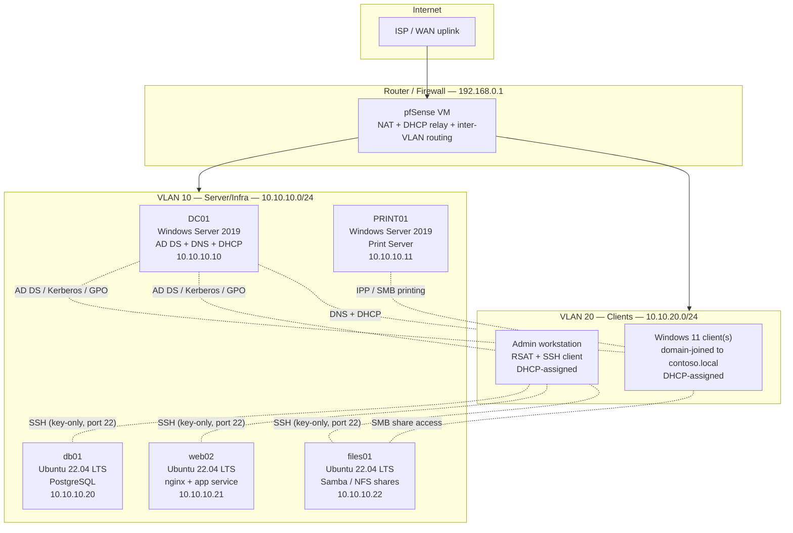

# Practice lab topology

> This describes a small home/virtualized practice lab used to reproduce
> the ticket scenarios and runbooks in this repo. It is not a production
> network and does not represent any real employer's infrastructure. IP
> ranges below are private RFC 1918 space chosen arbitrarily for the lab.

## Purpose

A minimal environment covering both sides of this portfolio: a
Windows/AD/M365-style domain for the Windows tickets and runbooks, and a
small Linux server fleet for the Linux tickets and runbooks, connected
through a router/firewall with a separate VLAN for client devices.

Built and run as VMs (this lab uses a local hypervisor — the specific
choice of Hyper-V/VirtualBox/Proxmox/VMware isn't load-bearing to the
design) on a single physical host, with a virtual switch providing the
VLAN segmentation described below.

## Topology diagram

## Component notes

### VLAN 10 — Server/Infra (10.10.10.0/24)

- **DC01** — Domain controller for `contoso.local`, also running DNS
  (AD-integrated zone) and DHCP for both VLANs (DHCP relay configured on
  the pfSense router for VLAN 20 scope). This is the box referenced
  throughout `tickets/windows/` and `runbooks/windows-ad-m365/`.
- **PRINT01** — Dedicated print server hosting shared printer queues,
  deployed to clients via Group Policy (see
  `runbooks/windows-ad-m365/gpo-deployment-procedure.md`).
- **db01, web02, files01** — Three Ubuntu 22.04 LTS servers standing in
  for a small Linux server fleet: a database host, an application/web
  host running a systemd-managed service, and a file server. These map
  directly to the hosts referenced in `tickets/linux/` and
  `runbooks/linux/`.

### VLAN 20 — Clients (10.10.20.0/24)

- One or more Windows 11 VMs, domain-joined to `contoso.local`, used to
  reproduce client-side symptoms (account lockouts, GPO application,
  BSOD triage, VPN client behavior).
- A dedicated admin workstation with RSAT tools (AD Users and Computers,
  Group Policy Management, DNS Manager) and an SSH client, used for both
  the Windows-side and Linux-side administrative work — mirrors how a
  help desk/sysadmin role in a small org typically administers both
  environments from one machine rather than having fully separate admin
  tooling per platform.

### Router/Firewall

A single pfSense VM handles inter-VLAN routing, NAT to the lab's WAN
uplink, and basic firewall rules (e.g. VLAN 20 clients can reach VLAN 10
servers on specific ports — SMB, RDP/SSH, printing — but VLAN 10 servers
cannot freely initiate connections back into VLAN 20, a simple form of
network segmentation between server and client tiers).

## What this lab is used for in this repo

- Reproducing the Windows-side scenarios in `tickets/windows/` against a
  real (if small) AD domain rather than describing them abstractly.
- Testing the PowerShell scripts in `scripts/powershell/` against a real
  `contoso.local`-equivalent AD/Exchange environment before documenting
  them.
- Testing the Bash scripts in `scripts/bash/` and the procedures in
  `runbooks/linux/` against the three Ubuntu hosts.
- Validating GPO deployment behavior, printer deployment, and DNS/DHCP
  interactions described in the Windows runbooks.

## Explicitly out of scope for this lab

- No real M365/Entra ID tenant is part of this lab topology — the M365/
  Exchange Online-specific tickets, runbooks, and scripts in this repo
  (Outlook/O365 sync, SSPR, Intune, mailbox management) are documented
  based on how those services work and how they're administered, not
  reproduced against a live tenant in this local lab, since that requires
  a real (even if trial) M365 subscription rather than something that can
  be self-hosted.
